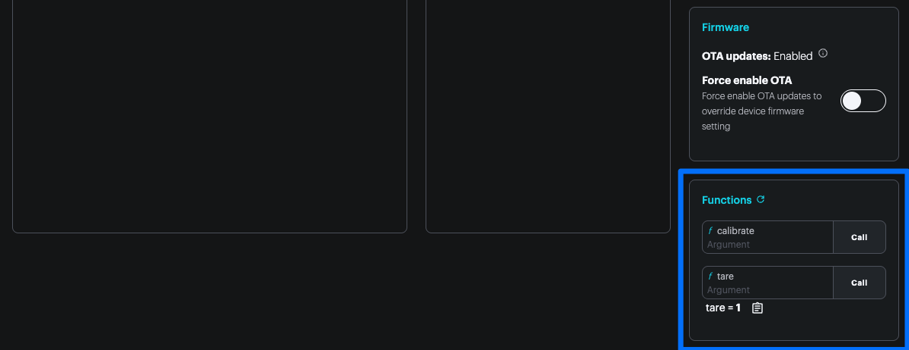

# Title

**Difficulty:** Intermediate

**Estimated Time:** 30 minutes

**Hardware Needed:** [Load cell](https://www.adafruit.com/product/4542) + [NAU7802 QWICC](https://www.adafruit.com/product/4538?srsltid=AfmBOorzuIOzhvsT5_uJGoeCpjHTmeGxpi8KsKiPguUbqlfVRkb5rQLK)

---

### Overview

This blueprint shows how to pull in a 3rd party library (in this case, an NAU7802 driver) into a Particle project.

---

### Tools & Materials

- [Particle Muon](https://store.particle.io/products/muon-lte-m-2g-wi-fi-lorawan-dev-board-for-north-america)
- USB cable
- [QWICC cable](https://www.adafruit.com/product/4401)
- [Load cell](https://www.adafruit.com/product/4542)
- [NAU7802 QWICC](https://www.adafruit.com/product/4538?srsltid=AfmBOorzuIOzhvsT5_uJGoeCpjHTmeGxpi8KsKiPguUbqlfVRkb5rQLK)

---

### Steps

1. **Clone this repository:**

   ```bash
   git clone https://github.com/particle-iot/blueprint-intermediate-temperature-ledger.git
   cd blueprint-intermediate-temperature-ledger
   ```

2. **Open the project** in Particle Workbench or your preferred editor.

3. **Flash to your device:**

   1. Configure project for your device using Particle Workbench and the command pallette (cmd / ctrl + shift + p):
      
   2. Select your device model and Device OS release:
      
      

4. **Open a serial terminal**:

   1. Open a serial monitor session by choosing `Particle: Serial monitor` from the command pallette:
      

5. **Observe output**. You should see logs that fluctuate based on the weight applied to the strain gauge.
   ```
   0000144382 [app] INFO: Reading: 81489 Weight: 0.00 Avg Weight: 0.00
   0000145995 [app] INFO: Reading: 81522 Weight: 0.00 Avg Weight: 0.00
   0000147609 [app] INFO: Reading: 81447 Weight: 0.00 Avg Weight: 0.00
   0000149222 [app] INFO: Reading: 194110 Weight: 458.59 Avg Weight: 114.65
   0000150836 [app] INFO: Reading: 81607 Weight: 0.00 Avg Weight: 114.65
   0000152448 [app] INFO: Reading: 81328 Weight: 0.00 Avg Weight: 114.65
   0000154062 [app] INFO: Reading: 81399 Weight: 0.00 Avg Weight: 114.65
   ```
6. **Note the 3rd party library**
   The NAU7802 driver is pulled in from Sparkfun's NAU7802 Arduino library. The library is stored in `./lib/nau7802` and the header can be directly included `#include "SparkFun_Qwiic_Scale_NAU7802_Arduino_Library.h"`

   The Particle compiler will pick up [correctly structured libraries](https://docs.particle.io/getting-started/device-os/firmware-libraries/#library-file-structure) in the `lib` folder.

   We've had the most luck with using Sparkfun libraries directly and without modification. Others may need a bit of adaptation for the Particle ecosystem.

---

### How It Works

1. Note the power configuration lines early in `setup`. This enables [3V3_AUX which powers the QWIIC expansion port](https://docs.particle.io/reference/datasheets/m-series/muon-datasheet/#expansion-and-peripheral-power) on the Muon.

   ```cpp
   // Put initialization like pinMode and begin functions here
   SystemPowerConfiguration powerConfig = System.getPowerConfiguration();
   powerConfig.auxiliaryPowerControlPin(D7).interruptPin(A7);
   System.setPowerConfiguration(powerConfig);
   ```

2. The firmware establishes two cloud functions `tare` and `calibrate`. These simply set flags that are serviced in the main `loop`.

   ```cpp
   int calibrate(String command)
   {
      shouldCalibrate = true;
      weightOnScale = command.toInt();
      return 1;
   }

   int tare(String command)
   {
      shouldTare = true;
      return 1;
   }

   void setup(){
      ...
      Particle.function("calibrate", calibrate);
      Particle.function("tare", tare);
   }

   void loop() {
      ...

      if (shouldCalibrate == true)
      {
      calibrateScale();
      shouldCalibrate = false;
      }
      if (shouldTare == true)
      {
      tareScale();
      shouldTare = false;
      }
   }
   ```

3. The `zero` and the `tare` values are stored in EEPROM so they persist across reboots:

   ```cpp
   // Record the current system settings to EEPROM
   void recordSystemSettings(void)
   {
      // Get various values from the library and commit them to NVM
      EEPROM.put(LOCATION_CALIBRATION_FACTOR, myScale.getCalibrationFactor());
      EEPROM.put(LOCATION_ZERO_OFFSET, myScale.getZeroOffset());
   }

   // Reads the current system settings from EEPROM
   // If anything looks weird, reset setting to default value
   void readSystemSettings(void)
   {
      float settingCalibrationFactor; // Value used to convert the load cell reading to lbs or kg
      uint32_t settingZeroOffset;     // Zero value that is found when scale is tared

      // Look up the calibration factor
      EEPROM.get(LOCATION_CALIBRATION_FACTOR, settingCalibrationFactor);
      if (settingCalibrationFactor == 0xFFFFFFFF)
      {
         settingCalibrationFactor = 1.0; // Default to 1.0
         EEPROM.put(LOCATION_CALIBRATION_FACTOR, settingCalibrationFactor);
      }

      // Look up the zero tare point
      EEPROM.get(LOCATION_ZERO_OFFSET, settingZeroOffset);
      if (settingZeroOffset == 0xFFFFFFFF)
      {
         settingZeroOffset = 0; // Default to 0 - i.e. no offset
         EEPROM.put(LOCATION_ZERO_OFFSET, settingZeroOffset);
      }

      // Pass these values to the library
      myScale.setCalibrationFactor(settingCalibrationFactor);
      myScale.setZeroOffset(settingZeroOffset);

      settingsDetected = true; // Assume for the moment that there are good cal values
      if (settingCalibrationFactor == 1.0 || settingZeroOffset == 0)
         settingsDetected = false; // Defaults detected. Prompt user to cal scale.
      }
   ```

---

### Usage

1. Connect the NAU7802 breakout to the QWIIC connector on the Muon as shown below. If you don't see the power indicator on the NAU7802 breakout, make sure the [3V3_AUX setting is enabled on the Muon's power module](https://docs.particle.io/reference/datasheets/m-series/muon-datasheet/#firmware-settings).

   

2. You can trigger the cloud functions from the device detail view in the Particle Console. Scroll down and find the `tare` and `calibrate` functions on the right panel. The `tare` function sets the zero point and the `calibrate` function will translate the current raw counts into a known weight. It's best to use a calibrated weight here.

   

---

### Topics Covered

- [I2C](https://docs.particle.io/reference/device-os/api/wire-i2c/#wire-i2c-)
- [Firmware libraries](https://docs.particle.io/getting-started/device-os/firmware-libraries/#overview)
- [Cloud functions](https://docs.particle.io/reference/device-os/api/cloud-functions/particle-function/#cloud-functions)

---

### Extensions

Try hooking up these load cell readings [to a 3rd party integration](https://docs.particle.io/integrations/introduction/)!
